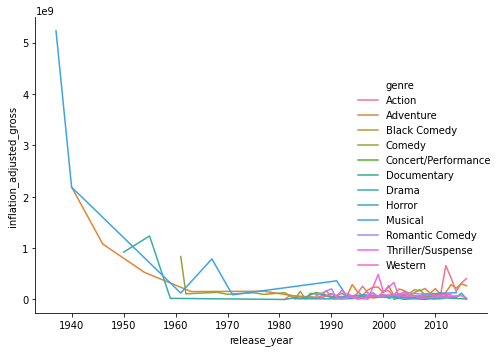

## 1. The dataset
<p>Walt Disney Studios is the foundation on which The Walt Disney Company was built. The Studios has produced more than 600 films since their debut film,  Snow White and the Seven Dwarfs in 1937. While many of its films were big hits, some of them were not. In this notebook, we will explore a dataset of Disney movies and analyze what contributes to the success of Disney movies.</p>
<p></p>
<p>First, we will take a look at the Disney data compiled by <a href="https://data.world/kgarrett/disney-character-success-00-16">Kelly Garrett</a>. The data contains 579 Disney movies with six features: movie title, release date, genre, MPAA rating, total gross, and inflation-adjusted gross. </p>
<p>Let's load the file and see what the data looks like.</p>

```python
# Import pandas library
import pandas as pd

# Read the file into gross
gross = pd.read_csv("datasets/disney_movies_total_gross.csv", 
                    parse_dates=["release_date"])

# Print out gross
gross.head()
```

<table border="1" class="dataframe">
  <thead>
    <tr style="text-align: right;">
      <th></th>
      <th>movie_title</th>
      <th>release_date</th>
      <th>genre</th>
      <th>mpaa_rating</th>
      <th>total_gross</th>
      <th>inflation_adjusted_gross</th>
    </tr>
  </thead>
  <tbody>
    <tr>
      <th>0</th>
      <td>Snow White and the Seven Dwarfs</td>
      <td>1937-12-21</td>
      <td>Musical</td>
      <td>G</td>
      <td>184925485</td>
      <td>5228953251</td>
    </tr>
    <tr>
      <th>1</th>
      <td>Pinocchio</td>
      <td>1940-02-09</td>
      <td>Adventure</td>
      <td>G</td>
      <td>84300000</td>
      <td>2188229052</td>
    </tr>
    <tr>
      <th>2</th>
      <td>Fantasia</td>
      <td>1940-11-13</td>
      <td>Musical</td>
      <td>G</td>
      <td>83320000</td>
      <td>2187090808</td>
    </tr>
    <tr>
      <th>3</th>
      <td>Song of the South</td>
      <td>1946-11-12</td>
      <td>Adventure</td>
      <td>G</td>
      <td>65000000</td>
      <td>1078510579</td>
    </tr>
    <tr>
      <th>4</th>
      <td>Cinderella</td>
      <td>1950-02-15</td>
      <td>Drama</td>
      <td>G</td>
      <td>85000000</td>
      <td>920608730</td>
    </tr>
  </tbody>
</table>

```python
# One or more tests of the student's code
# The @solution should pass the tests
# The purpose of the tests is to try to catch common errors and
# to give the student a hint on how to resolve these errors

def test_pandas_loaded():
    assert 'pd' in globals(), \
    'Did you import the pandas library aliased as pd?'

def test_parse_date():
    assert gross['release_date'].dtype == '<M8[ns]', \
    "The release_date column is not of dtype <M8[ns]."
      
def test_gross_correctly_loaded():
    correct_gross = pd.read_csv('./datasets/disney_movies_total_gross.csv', parse_dates=['release_date'])
    assert correct_gross.equals(gross), "The DataFrame gross should contain the data in disney_movies_total_gross.csv."
```

    3/3 tests passed

## 2. Top ten movies at the box office
<p>Let's started by exploring the data. We will check which are the 10 Disney movies that have earned the most at the box office. We can do this by sorting movies by their inflation-adjusted gross (we will call it adjusted gross from this point onward). </p>

```python
# Sort data by the adjusted gross in descending order 
inflation_adjusted_gross_desc = gross.sort_values(by='inflation_adjusted_gross', ascending=False)

# Display the top 10 movies 
inflation_adjusted_gross_desc.head(10)
```

<table border="1" class="dataframe">
  <thead>
    <tr style="text-align: right;">
      <th></th>
      <th>movie_title</th>
      <th>release_date</th>
      <th>genre</th>
      <th>mpaa_rating</th>
      <th>total_gross</th>
      <th>inflation_adjusted_gross</th>
    </tr>
  </thead>
  <tbody>
    <tr>
      <th>0</th>
      <td>Snow White and the Seven Dwarfs</td>
      <td>1937-12-21</td>
      <td>Musical</td>
      <td>G</td>
      <td>184925485</td>
      <td>5228953251</td>
    </tr>
    <tr>
      <th>1</th>
      <td>Pinocchio</td>
      <td>1940-02-09</td>
      <td>Adventure</td>
      <td>G</td>
      <td>84300000</td>
      <td>2188229052</td>
    </tr>
    <tr>
      <th>2</th>
      <td>Fantasia</td>
      <td>1940-11-13</td>
      <td>Musical</td>
      <td>G</td>
      <td>83320000</td>
      <td>2187090808</td>
    </tr>
    <tr>
      <th>8</th>
      <td>101 Dalmatians</td>
      <td>1961-01-25</td>
      <td>Comedy</td>
      <td>G</td>
      <td>153000000</td>
      <td>1362870985</td>
    </tr>
    <tr>
      <th>6</th>
      <td>Lady and the Tramp</td>
      <td>1955-06-22</td>
      <td>Drama</td>
      <td>G</td>
      <td>93600000</td>
      <td>1236035515</td>
    </tr>
    <tr>
      <th>3</th>
      <td>Song of the South</td>
      <td>1946-11-12</td>
      <td>Adventure</td>
      <td>G</td>
      <td>65000000</td>
      <td>1078510579</td>
    </tr>
    <tr>
      <th>564</th>
      <td>Star Wars Ep. VII: The Force Awakens</td>
      <td>2015-12-18</td>
      <td>Adventure</td>
      <td>PG-13</td>
      <td>936662225</td>
      <td>936662225</td>
    </tr>
    <tr>
      <th>4</th>
      <td>Cinderella</td>
      <td>1950-02-15</td>
      <td>Drama</td>
      <td>G</td>
      <td>85000000</td>
      <td>920608730</td>
    </tr>
    <tr>
      <th>13</th>
      <td>The Jungle Book</td>
      <td>1967-10-18</td>
      <td>Musical</td>
      <td>Not Rated</td>
      <td>141843000</td>
      <td>789612346</td>
    </tr>
    <tr>
      <th>179</th>
      <td>The Lion King</td>
      <td>1994-06-15</td>
      <td>Adventure</td>
      <td>G</td>
      <td>422780140</td>
      <td>761640898</td>
    </tr>
  </tbody>
</table>

```python
# One or more tests of the student's code
# The @solution should pass the tests
# The purpose of the tests is to try to catch common errors and
# to give the student a hint on how to resolve these errors

last_output = _

def test_sort_output():
    try:
        assert (last_output.iloc[0][0] == 'Snow White and the Seven Dwarfs'  and 
        last_output.iloc[9][0] == 'The Lion King')
    except AttributeError:
        assert False, \
            "Please use head() as the last line of code in the cell to display the data, not the display() or print() functions."
    except AssertionError:
        assert False, \
            "The data was not sorted correctly. You should see Snow White and the Seven Dwarf in the first row and The Lion King in the tenth row of the output."
    except IndexError:
        assert False, \
            "Did you return the first 10 rows of the output?"
        
def test_head_output():
    try:
        assert last_output.shape == (10,6)
    except AttributeError:
        assert False, \
            "Please use head() as the last line of code in the cell to display the data, not the display() or print() functions."
    except AssertionError:
        assert False, \
            "Did you return the first 10 rows of the output?"
```

    2/2 tests passed

## 3. Movie genre trend
<p>From the top 10 movies above, it seems that some genres are more popular than others. So, we will check which genres are growing stronger in popularity. To do this, we will group movies by genre and then by year to see the adjusted gross of each genre in each year.</p>

```python
# Extract year from release_date and store it in a new column
gross['release_year'] = pd.DatetimeIndex(gross["release_date"]).year 

# Compute mean of adjusted gross per genre and per year
group = gross.groupby(['genre','release_year']).mean()

# Convert the GroupBy object to a DataFrame
genre_yearly = group.reset_index()

# Inspect genre_yearly 
genre_yearly.head(10)
```

<table border="1" class="dataframe">
  <thead>
    <tr style="text-align: right;">
      <th></th>
      <th>genre</th>
      <th>release_year</th>
      <th>total_gross</th>
      <th>inflation_adjusted_gross</th>
    </tr>
  </thead>
  <tbody>
    <tr>
      <th>0</th>
      <td>Action</td>
      <td>1981</td>
      <td>0.0</td>
      <td>0.0</td>
    </tr>
    <tr>
      <th>1</th>
      <td>Action</td>
      <td>1982</td>
      <td>26918576.0</td>
      <td>77184895.0</td>
    </tr>
    <tr>
      <th>2</th>
      <td>Action</td>
      <td>1988</td>
      <td>17577696.0</td>
      <td>36053517.0</td>
    </tr>
    <tr>
      <th>3</th>
      <td>Action</td>
      <td>1990</td>
      <td>59249588.5</td>
      <td>118358772.0</td>
    </tr>
    <tr>
      <th>4</th>
      <td>Action</td>
      <td>1991</td>
      <td>28924936.5</td>
      <td>57918572.5</td>
    </tr>
    <tr>
      <th>5</th>
      <td>Action</td>
      <td>1992</td>
      <td>29028000.0</td>
      <td>58965304.0</td>
    </tr>
    <tr>
      <th>6</th>
      <td>Action</td>
      <td>1993</td>
      <td>21943553.5</td>
      <td>44682157.0</td>
    </tr>
    <tr>
      <th>7</th>
      <td>Action</td>
      <td>1994</td>
      <td>19180582.0</td>
      <td>39545796.0</td>
    </tr>
    <tr>
      <th>8</th>
      <td>Action</td>
      <td>1995</td>
      <td>63037553.5</td>
      <td>122162426.5</td>
    </tr>
    <tr>
      <th>9</th>
      <td>Action</td>
      <td>1996</td>
      <td>135281096.0</td>
      <td>257755262.5</td>
    </tr>
  </tbody>
</table>

```python
import numpy 

# One or more tests of the student's code
# The @solution should pass the tests
# The purpose of the tests is to try to catch common errors and
# to give the student a hint on how to resolve these errors

correct_group_result = gross.groupby(['genre','release_year']).mean()

def test_release_year_exists():
    assert 'release_year' in gross, \
        "The column release_year was not correctly created."

def test_release_year_correctly_created():
    correct_release_year = pd.Series(pd.DatetimeIndex(gross['release_date']).year )
    assert numpy.array_equal(gross['release_year'].values,correct_release_year.values), \
    "The values in the column release_year looks incorrect." 

def test_group_correctly_created():
    assert isinstance(group, pd.DataFrame),\
    "The variable group was not created correctly."

def test_group_value():
    assert group.iloc[2]['total_gross'] == 17577696 ,\
    "The variable group has incorrect values."
    
def test_group_shape():
    assert correct_group_result.shape == group.shape, \
    "The variable group should have 218 rows and 2 columns."
 
def test_group_column_names():
     assert correct_group_result.index.names == group.index.names, \
    "The variable group should have two index names in this order: 'genre', 'release_year'."
        
def test_genre_yearly_correctly_created():
    correct_genre_yearly_result = group.reset_index()
    assert correct_genre_yearly_result.equals(genre_yearly), \
    "The variable genre_yearly looks incorrect."
    #assert isinstance(genre_yearly, pd.DataFrame),\
    #"The variable genre_yearly is not a DataFrame." 

def test_genre_yearly_shape():
    assert genre_yearly.shape[1] == 4, \
    'There should be four columns in the genre_yearly DataFrame.'
```

    8/8 tests passed

## 4. Visualize the genre popularity trend
<p>We will make a plot out of these means of groups to better see how box office revenues have changed over time.</p>

```python
# Import seaborn library
import seaborn as sns

# Plot the data  
sns.relplot(x='release_year', y='inflation_adjusted_gross', kind='line', 
            hue='genre', data=genre_yearly)  
```

    <seaborn.axisgrid.FacetGrid at 0x7fe043a9db70>



```python
# One or more tests of the student's code
# The @solution should pass the tests
# The purpose of the tests is to try to catch common errors and
# to give the student a hint on how to resolve these errors

last_value = _
def test_sns_exists():
    assert 'sns' in globals(), \
        "Did you import the seaborn library aliased as sns?'"

def test_plot_exists():
    assert isinstance(last_value, sns.axisgrid.FacetGrid),\
    "Did you created a line plot yet?"

def test_line_plot():
    assert len(last_value.ax.get_lines()) == 25,\
    "The line plot looks incorrect."

def test_x_data(): # Test the first x value in the first line 
    #assert list(last_value.ax.get_lines()[0].get_xdata()) == list(genre_yearly[genre_yearly['genre'] =='Action']['release_year']), \
    assert last_value.ax.get_lines()[0].get_xdata()[0] in list(gross['release_year']), \
    'The x-axis data looks incorrect.'
    
def test_y_data(): # Test the first y value in the first line 
        assert last_value.ax.get_lines()[0].get_ydata()[0] in list(gross['inflation_adjusted_gross']), \
    'The y-axis data looks incorrect.'
    
def test_hue_data():
    assert list(last_value.ax.get_legend_handles_labels()[1][1::])  == list(genre_yearly['genre'].unique()), \
    'The hue data looks incorrect.'
```

    6/6 tests passed

## 5. Data transformation
<p>The line plot supports our belief that some genres are growing faster in popularity than others. For Disney movies, Action and Adventure genres are growing the fastest. Next, we will build a linear regression model to understand the relationship between genre and box office gross. </p>
<p>Since linear regression requires numerical variables and the genre variable is a categorical variable, we'll use a technique called one-hot encoding to convert the categorical variables to numerical. This technique transforms each category value into a new column and assigns a 1 or 0 to the column. </p>
<p>For this dataset, there will be 11 dummy variables, one for each genre except the action genre which we will use as a baseline. For example, if a movie is an adventure movie, like The Lion King, the adventure variable will be 1 and other dummy variables will be 0. Since the action genre is our baseline, if a movie is an action movie, such as The Avengers, all dummy variables will be 0.</p>

```python
# Convert genre variable to dummy variables 
genre_dummies = pd.get_dummies(data=gross['genre'], drop_first=True)

# Inspect genre_dummies
genre_dummies.head()
```

<table border="1" class="dataframe">
  <thead>
    <tr style="text-align: right;">
      <th></th>
      <th>Adventure</th>
      <th>Black Comedy</th>
      <th>Comedy</th>
      <th>Concert/Performance</th>
      <th>Documentary</th>
      <th>Drama</th>
      <th>Horror</th>
      <th>Musical</th>
      <th>Romantic Comedy</th>
      <th>Thriller/Suspense</th>
      <th>Western</th>
    </tr>
  </thead>
  <tbody>
    <tr>
      <th>0</th>
      <td>0</td>
      <td>0</td>
      <td>0</td>
      <td>0</td>
      <td>0</td>
      <td>0</td>
      <td>0</td>
      <td>1</td>
      <td>0</td>
      <td>0</td>
      <td>0</td>
    </tr>
    <tr>
      <th>1</th>
      <td>1</td>
      <td>0</td>
      <td>0</td>
      <td>0</td>
      <td>0</td>
      <td>0</td>
      <td>0</td>
      <td>0</td>
      <td>0</td>
      <td>0</td>
      <td>0</td>
    </tr>
    <tr>
      <th>2</th>
      <td>0</td>
      <td>0</td>
      <td>0</td>
      <td>0</td>
      <td>0</td>
      <td>0</td>
      <td>0</td>
      <td>1</td>
      <td>0</td>
      <td>0</td>
      <td>0</td>
    </tr>
    <tr>
      <th>3</th>
      <td>1</td>
      <td>0</td>
      <td>0</td>
      <td>0</td>
      <td>0</td>
      <td>0</td>
      <td>0</td>
      <td>0</td>
      <td>0</td>
      <td>0</td>
      <td>0</td>
    </tr>
    <tr>
      <th>4</th>
      <td>0</td>
      <td>0</td>
      <td>0</td>
      <td>0</td>
      <td>0</td>
      <td>1</td>
      <td>0</td>
      <td>0</td>
      <td>0</td>
      <td>0</td>
      <td>0</td>
    </tr>
  </tbody>
</table>

```python
# One or more tests of the student's code
# The @solution should pass the tests
# The purpose of the tests is to try to catch common errors and
# to give the student a hint on how to resolve these errors

def test_genre_dummies_exists():
    assert 'genre_dummies' in globals(), \
     "The variable genre_dummies was not correctly created."

def test_correct_dummies_numbers():
    assert isinstance(genre_dummies, pd.DataFrame) and genre_dummies.shape == (579, 11), \
        "The genre_dummies should be a DataFrame with 11 columns and 579 rows."  

def test_correct_dummies_values():
    assert list(genre_dummies.iloc[0]) ==  [0, 0, 0, 0, 0, 0, 0, 1, 0, 0, 0], \
        "The genre_dummies should contain one 1 and ten 0s for all genres except the action genre."
```

    3/3 tests passed

## 6. The genre effect
<p>Now that we have dummy variables, we can build a linear regression model to predict the adjusted gross using these dummy variables.</p>
<p>From the regression model, we can check the effect of each genre by looking at its coefficient given in units of box office gross dollars. We will focus on the impact of action and adventure genres here. (Note that the intercept and the first coefficient values represent the effect of action and adventure genres respectively). We expect that movies like the Lion King or Star Wars would perform better for box office.</p>

```python
# Import LinearRegression
from sklearn.linear_model import LinearRegression

# Build a linear regression model
regr = LinearRegression()

# Fit regr to the dataset
regr.fit(genre_dummies, gross["inflation_adjusted_gross"])

# Get estimated intercept and coefficient values 
action =  regr.intercept_
adventure = regr.coef_[[0]][0]

# Inspect the estimated intercept and coefficient values 
print((action, adventure))
```

    (102921757.36841896, 87475654.70910127)

```python
# One or more tests of the student's code
# The @solution should pass the tests
# The purpose of the tests is to try to catch common errors and
# to give the student a hint on how to resolve these errors
from sklearn.utils import validation 
from sklearn.exceptions import NotFittedError


def test_LinearRegression_loaded():
    assert 'LinearRegression' in globals(), \
    'Did you import LinearRegression from sklearn.linear_model?'

def test_regr_exists():
    assert "regr" in globals(), \
        "The variable regr was not correctly created."
    
def test_regr_is_model():
    assert isinstance(regr, LinearRegression),\
    "regr should be a LinearRegression model." 

def test_regr_is_fitted():
    try:
        validation.check_is_fitted(regr, "coef_")
 
    except NotFittedError:
        assert False, "regr is not fitted yet."

def test_correct_features():
    assert   regr.coef_.size == 11, \
    "regr doesn't have a correct number of coefficients. Did you use the correct regressors X?"

        
def test_correct_intercept():
    assert round(action) == 102921757,\
    "The value of action looks incorrect."
```

    6/6 tests passed

## 7. Confidence intervals for regression parameters  (i)
<p>Next, we will compute 95% confidence intervals for the intercept and coefficients. The 95% confidence intervals for the intercept  <b><i>a</i></b> and coefficient <b><i>b<sub>i</sub></i></b> means that the intervals have a probability of 95% to contain the true value <b><i>a</i></b> and coefficient <b><i>b<sub>i</sub></i></b> respectively. If there is a significant relationship between a given genre and the adjusted gross, the confidence interval of its coefficient should exclude 0.      </p>
<p>We will calculate the confidence intervals using the pairs bootstrap method. </p>

```python
# Import a module
import numpy as np

# Create an array of indices to sample from 
inds = np.arange(len(gross['genre']))

# Initialize 500 replicate arrays
size = 500
bs_action_reps =  np.empty(size)
bs_adventure_reps =  np.empty(size)
```

```python
# One or more tests of the student's code
# The @solution should pass the tests
# The purpose of the tests is to try to catch common errors and
# to give the student a hint on how to resolve these errors

def test_inds_exists():
    assert "inds" in globals(), \
        "The variable inds was not correctly created."
    
def test_inds_type(): 
    assert  isinstance(inds, np.ndarray) ,\
    "Type of inds should be ndarray."

#def test_inds_shape(): 
#    assert  inds.size==579  ,\
#    "Length of inds should be 579."    

def test_inds_shape(): 
    try:
        assert inds.size==579
    except AttributeError:
        assert False, \
            "Make sure that inds is an ndarray of length 579."
    except AssertionError:
        assert False, \
            "Length of inds should be 579."  
        
def test_bs_action_reps_type(): 
    assert  isinstance(bs_action_reps, np.ndarray) ,\
    "Type of bs_action_reps should be ndarray."
    
#def test_bs_action_reps_shape(): 
#    assert bs_action_reps.size == 1000  ,\
#    "Length of bs_action_reps should be 1000."

def test_bs_action_reps_shape(): 
    try:
        assert bs_action_reps.size == 500
    except AttributeError:
        assert False, \
            "Make sure that bs_action_reps is an ndarray of length 500."
    except AssertionError:
        assert False, \
            "Length of bs_action_reps should be 500."
        
def test_bs_adventure_reps_type(): 
    assert  isinstance(bs_adventure_reps, np.ndarray) ,\
    "Type of bs_adventure_reps should be ndarray."
 

#def test_bs_adventure_reps_shape(): 
#    assert bs_adventure_reps.size == 500  ,\
#    "Length of bs_adventure_reps should be 500."
    
def test_bs_adventure_reps_shape(): 
    try:
        assert bs_adventure_reps.size == 500
    except AttributeError:
        assert False, \
            "Make sure that bs_adventure_reps is an ndarray of length 500."
    except AssertionError:
        assert False, \
            "Length of bs_adventure_reps should be 500."
```

    7/7 tests passed

## 8. Confidence intervals for regression parameters  (ii)
<p>After the initialization, we will perform pair bootstrap estimates for the regression parameters. Note that we will draw a sample from a set of (genre, adjusted gross) data where the genre is the original genre variable. We will perform one-hot encoding after that. </p>

```python
# Generate replicates  
for i in range(size):
    
    # Resample the indices 
    bs_inds = np.random.choice(inds, size=len(inds))
    
    # Get the sampled genre and sampled adjusted gross
    bs_genre = gross['genre'][bs_inds] 
    bs_gross = gross['inflation_adjusted_gross'][bs_inds]
    
    # Convert sampled genre to dummy variables
    bs_dummies = pd.get_dummies(data=gross['genre'] , drop_first=True)
   
    # Build and fit a regression model 
    regr = LinearRegression().fit(bs_dummies, bs_gross)
    
    # Compute replicates of estimated intercept and coefficient
    bs_action_reps[i] = regr.intercept_
    bs_adventure_reps[i] = regr.coef_[[0]][0]
```

```python
# One or more tests of the student's code
# The @solution should pass the tests
# The purpose of the tests is to try to catch common errors and
# to give the student a hint on how to resolve these errors

def test_bs_inds_exists():
     assert 'bs_inds' in globals(), \
    'Did you create the variable bs_inds to store the resampled indices?'

def test_bs_inds_type():
     assert isinstance(bs_inds, np.ndarray), \
    'Type of bs_inds should be ndarray.' 
  
def test_bs_inds_size():
     assert bs_inds.size == 579, \
    'Size of bs_inds should be 579.' 
   
def test_bs_gross_type(): 
    assert  isinstance(bs_gross, pd.core.series.Series) ,\
    "Type of bs_gross should be Pandas Series."
    
def test_bs_gross_dtype(): 
    assert  bs_gross.dtype == 'int64' ,\
    "Type of elements in bs_gross should be int64."
    
def test_bs_gross_shape(): 
    assert  bs_gross.size == 579  ,\
    "Size of bs_gross should be 579."

def test_bs_gross_is_randomized(): 
    assert not bs_gross.equals(gross['inflation_adjusted_gross'])  ,\
    "bs_gross should not be the same as the inflation_adjusted_gross."
    
def test_bs_dummies_exists():
     assert 'bs_dummies' in globals(), \
    'The variable bs_dummies was not correctly created.'

def test_bs_dummies_DataFrame():
    assert isinstance(bs_dummies, pd.DataFrame), \
        "bs_dummies should be a DataFrame."  
    
def test_correct_bs_dummies_numbers():
    assert  bs_dummies.shape == (579, 11), \
        "bs_dummies should be a DataFrame with 11 columns and 579 rows."  

def test_correct_bs_dummies_values(): 
    assert set(bs_dummies.iloc[0]) == {0, 1} or set(bs_dummies.iloc[0]) == {0}, \
        "The values of bs_dummies looks incorrect."  

def test_bs_action_reps_type(): 
    assert  isinstance(bs_action_reps, np.ndarray) ,\
    "Type of bs_action_reps should be a NumPy array."

def test_bs_action_reps_shape(): 
    assert  bs_action_reps.size == 500  ,\
    "Size of bs_gross should be 500."
    
def test_bs_action_reps_value():
    assert bs_action_reps[499] == regr.intercept_,\
        "The value of bs_action_reps looks incorrect."
```

    14/14 tests passed

## 9. Confidence intervals for regression parameters (iii)
<p>Finally, we compute 95% confidence intervals for the intercept and coefficient and examine if they exclude 0. If one of them (or both) does, then it is unlikely that the value is 0 and we can conclude that there is a significant relationship between that genre and the adjusted gross. </p>

```python
# Compute 95% confidence intervals for intercept and coefficient values
confidence_interval_action = np.percentile(bs_action_reps, [2.5, 97.5]) 
confidence_interval_adventure = np.percentile(bs_adventure_reps, [2.5, 97.5])
    
# Inspect the confidence intervals
print(confidence_interval_action)
print(confidence_interval_adventure)
```

    [7.28575622e+07 2.11111844e+08]
    [-92113457.74460441  83351314.17233777]

```python
# One or more tests of the student's code
# The @solution should pass the tests
# The purpose of the tests is to try to catch common errors and
# to give the student a hint on how to resolve these errors

correct_confidence_interval_action = np.percentile(bs_action_reps, [2.5, 97.5])
correct_confidence_interval_adventure = np.percentile(bs_adventure_reps, [2.5, 97.5])

def test_confidence_interval_action_exists():
    assert 'confidence_interval_action' in globals(),\
    "confidence_interval_action was not correctly created."
    
def test_confidence_interval_adventure_exists():
    assert 'confidence_interval_adventure' in globals(),\
    "confidence_interval_adventure was not correctly created."
   
def test_confidence_interval_action_type(): 
    assert  isinstance(confidence_interval_action, np.ndarray) ,\
    "Type of confidence_interval_action should be a NumPy array."
    
def test_confidence_interval_action_values(): 
    assert (confidence_interval_action == correct_confidence_interval_action).all(),\
    "Values in confidence_interval_action look incorrect."
    
def test_confidence_interval_action_shape(): 
    assert  confidence_interval_action.size == 2  ,\
    "Length of confidence_interval_action should be 2."

def test_confidence_interval_adventure_type(): 
    assert  isinstance(confidence_interval_adventure, np.ndarray) ,\
    "Type of confidence_interval_adventure should be a Numpy array."
    
def test_confidence_interval_adventure_values(): 
    assert  (confidence_interval_adventure == correct_confidence_interval_adventure).all(),\
    "Values in confidence_interval_adventure look incorrect."
      
def test_confidence_interval_adventure_shape(): 
    assert  confidence_interval_adventure.size == 2  ,\
    "Length of confidence_interval_adventure should be 2."
```

    8/8 tests passed

## 10. Should Disney make more action and adventure movies?
<p>The confidence intervals from the bootstrap method for the intercept and coefficient do not contain the value zero, as we have already seen that lower and upper bounds of both confidence intervals are positive. These tell us that it is likely that the adjusted gross is significantly correlated with the action and adventure genres. </p>
<p>From the results of the bootstrap analysis and the trend plot we have done earlier, we could say that Disney movies with plots that fit into the action and adventure genre, according to our data, tend to do better in terms of adjusted gross than other genres. So we could expect more Marvel, Star Wars, and live-action movies in the upcoming years!</p>

```python
# should Disney studios make more action and adventure movies? 
more_action_adventure_movies = True
```

```python
# One or more tests of the student's code
# The @solution should pass the tests
# The purpose of the tests is to try to catch common errors and
# to give the student a hint on how to resolve these errors

def test_more_action_adventure_movies_type():
    assert isinstance(more_action_adventure_movies, bool), \
        'more_action_adventure_movies should be of Boolean type.'
    
def test_conclusion():
    assert more_action_adventure_movies, \
        'That is not a reasonable conclusion given the values of confidence intervals.'
```

    2/2 tests passed
