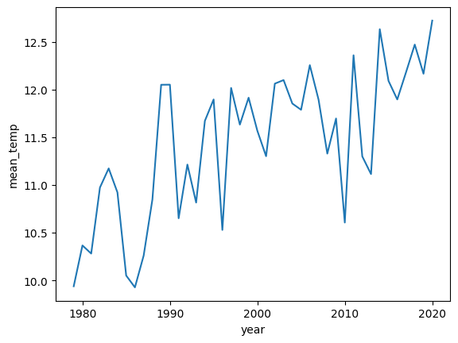
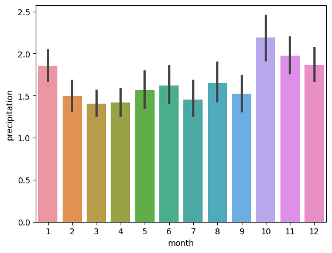
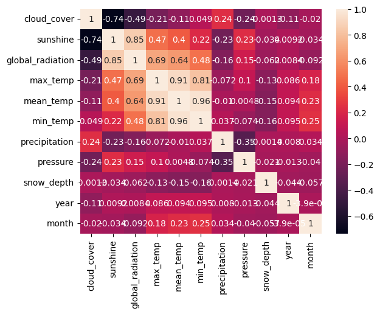

# Predicting Temperature in London


As the climate changes, predicting the weather becomes ever more important for businesses. Since the weather depends on a lot of different factors, you will want to run a lot of experiments to determine what the best approach is to predict the weather. In this project, you will run experiments for different regression models predicting the mean temperature, using a combination of `sklearn` and `MLflow`.

You will be working with data stored in `london_weather.csv`, which contains the following columns:
- **date** - recorded date of measurement - (**int**)
- **cloud_cover** - cloud cover measurement in oktas - (**float**)
- **sunshine** - sunshine measurement in hours (hrs) - (**float**)
- **global_radiation** - irradiance measurement in Watt per square meter (W/m2) - (**float**)
- **max_temp** - maximum temperature recorded in degrees Celsius (°C) - (**float**)
- **mean_temp** - mean temperature in degrees Celsius (°C) - (**float**)
- **min_temp** - minimum temperature recorded in degrees Celsius (°C) - (**float**)
- **precipitation** - precipitation measurement in millimeters (mm) - (**float**)
- **pressure** - pressure measurement in Pascals (Pa) - (**float**)
- **snow_depth** - snow depth measurement in centimeters (cm) - (**float**)

```python
# Run this cell to import the modules you require
import pandas as pd
import numpy as np
import mlflow
import mlflow.sklearn
import matplotlib.pyplot as plt
import seaborn as sns
from sklearn.model_selection import train_test_split
from sklearn.metrics import mean_squared_error
from sklearn.impute import SimpleImputer
from sklearn.preprocessing import StandardScaler
from sklearn.linear_model import LinearRegression
from sklearn.tree import DecisionTreeRegressor
from sklearn.ensemble import RandomForestRegressor
```

```python
# Import the data and perform exploratory data analysis
weather = pd.read_csv('london_weather.csv')
weather.info()
```

    <class 'pandas.core.frame.DataFrame'>
    RangeIndex: 15341 entries, 0 to 15340
    Data columns (total 10 columns):
     #   Column            Non-Null Count  Dtype  
    ---  ------            --------------  -----  
     0   date              15341 non-null  int64  
     1   cloud_cover       15322 non-null  float64
     2   sunshine          15341 non-null  float64
     3   global_radiation  15322 non-null  float64
     4   max_temp          15335 non-null  float64
     5   mean_temp         15305 non-null  float64
     6   min_temp          15339 non-null  float64
     7   precipitation     15335 non-null  float64
     8   pressure          15337 non-null  float64
     9   snow_depth        13900 non-null  float64
    dtypes: float64(9), int64(1)
    memory usage: 1.2 MB

```python
weather['date'] = pd.to_datetime(weather['date'], format='%Y%m%d')
weather['year'] = weather['date'].dt.year
weather['month'] = weather['date'].dt.month
weather_metrics = ['cloud_cover', 'sunshine', 'global_radiation', 'max_temp', 'mean_temp', 'min_temp', 'precipitation', 'pressure', 'snow_depth']
weather_per_month = weather.groupby(['year', 'month'], as_index = False)[weather_metrics].mean()
```

```python
sns.lineplot(x="year", y="mean_temp", data=weather_per_month, ci=None)
plt.show()
```

    <ipython-input-4-3fbc8dae403c>:1: FutureWarning: 
    
    The `ci` parameter is deprecated. Use `errorbar=None` for the same effect.
    
      sns.lineplot(x="year", y="mean_temp", data=weather_per_month, ci=None)



```python
sns.barplot(x='month', y='precipitation', data=weather)
plt.show()
```



```python
sns.heatmap(weather.corr(), annot=True)
plt.show()
```

    <ipython-input-6-98bcb45cfc8d>:1: FutureWarning: The default value of numeric_only in DataFrame.corr is deprecated. In a future version, it will default to False. Select only valid columns or specify the value of numeric_only to silence this warning.
      sns.heatmap(weather.corr(), annot=True)



```python
# Choose features, define the target, and drop null values
feature_selection = ['month', 'cloud_cover', 'sunshine', 'precipitation', 'pressure', 'global_radiation']
target_var = 'mean_temp'
weather = weather.dropna(subset=['mean_temp'])
```

```python
# Load data and perform exploratory analysis
def preprocess_df(df, feature_selection, target_var):
    """
    Split dataframe into X and y, and train and test consecutively. Then impute and scale both train and test features. Returns the train and test ets
    """
    # Subset the data
    X = df[feature_selection]    
    y = df[target_var]
    
    # Split the data
    X_train, X_test, y_train, y_test = train_test_split(X, y, test_size=0.33, random_state=1)
    
    # Impute missing values
    imputer = SimpleImputer(strategy="mean")
    # Fit on the training data
    X_train = imputer.fit_transform(X_train)
    # Transform on the test data
    X_test  = imputer.transform(X_test)
    
    # Scale the data
    scaler = StandardScaler()
    # Fit on the training data
    X_train = scaler.fit_transform(X_train)
    # Transform on the test data
    X_test = scaler.transform(X_test)
    
    return X_train, X_test, y_train, y_test
```

```python
X_train, X_test, y_train, y_test = preprocess_df(weather, feature_selection, target_var)
```

```python
# Predict on the test set and evaluate performance
def predict_and_evaluate(model, x_test, y_test):
    """
    Predict values from test set, calculate and return the root mean squared error.
    """
    y_pred = model.predict(x_test)
    rmse = np.sqrt(mean_squared_error(y_test, y_pred))    
    return rmse
```

```python
# Create an experiment
experiment_name = "weather_prediction"
experiment_id = mlflow.create_experiment(experiment_name)
```

```python
# Predict, evaluate, and log the parameters and metrics of your models
for idx, depth in enumerate([1, 2, 5, 10, 20]):
    parameters = {
        'max_depth': depth
    }    
    run_name = f"run_{idx}"
    with mlflow.start_run(experiment_id=experiment_id, run_name=run_name):
        # Create models
        lin_reg = LinearRegression().fit(X_train, y_train)
        tree_reg = DecisionTreeRegressor(random_state=42, max_depth=depth).fit(X_train, y_train)
        forest_reg = RandomForestRegressor(random_state=42, max_depth=depth).fit(X_train, y_train)
        # Log models
        mlflow.sklearn.log_model(lin_reg, "lin_reg")
        mlflow.sklearn.log_model(tree_reg, "tree_reg")
        mlflow.sklearn.log_model(forest_reg, "forest_reg")
        # Evaluate performance
        lin_reg_rmse = predict_and_evaluate(lin_reg, X_test, y_test)
        tree_reg_rmse = predict_and_evaluate(tree_reg, X_test, y_test)
        forest_reg_rmse = predict_and_evaluate(forest_reg, X_test, y_test)
        # Log performance
        mlflow.log_param("max_depth", depth)
        mlflow.log_metric("rmse_lr", lin_reg_rmse)
        mlflow.log_metric("rmse_tr", tree_reg_rmse)
        mlflow.log_metric("rmse_fr", forest_reg_rmse)
```

    /usr/local/lib/python3.10/dist-packages/_distutils_hack/__init__.py:33: UserWarning: Setuptools is replacing distutils.
      warnings.warn("Setuptools is replacing distutils.")

```python
# Search the runs for the experiment's results
experiment_results = mlflow.search_runs(experiment_names=[experiment_name])
experiment_results
```

<table border="1" class="dataframe">
  <thead>
    <tr style="text-align: right;">
      <th></th>
      <th>run_id</th>
      <th>experiment_id</th>
      <th>status</th>
      <th>artifact_uri</th>
      <th>start_time</th>
      <th>end_time</th>
      <th>metrics.rmse_fr</th>
      <th>metrics.rmse_tr</th>
      <th>metrics.rmse_lr</th>
      <th>params.max_depth</th>
      <th>tags.mlflow.source.name</th>
      <th>tags.mlflow.source.type</th>
      <th>tags.mlflow.log-model.history</th>
      <th>tags.mlflow.runName</th>
      <th>tags.mlflow.user</th>
    </tr>
  </thead>
  <tbody>
    <tr>
      <th>0</th>
      <td>f630fc0bfdcb4246aee18f2052276ab7</td>
      <td>253932435945555803</td>
      <td>FINISHED</td>
      <td>file:///content/mlruns/253932435945555803/f630...</td>
      <td>2023-06-02 23:12:07.900000+00:00</td>
      <td>2023-06-02 23:12:18.930000+00:00</td>
      <td>2.893355</td>
      <td>3.807963</td>
      <td>3.866773</td>
      <td>20</td>
      <td>/usr/local/lib/python3.10/dist-packages/ipyker...</td>
      <td>LOCAL</td>
      <td>[{"run_id": "f630fc0bfdcb4246aee18f2052276ab7"...</td>
      <td>run_4</td>
      <td>root</td>
    </tr>
    <tr>
      <th>1</th>
      <td>48a72d9524744fa4b74faf03abf2cea1</td>
      <td>253932435945555803</td>
      <td>FINISHED</td>
      <td>file:///content/mlruns/253932435945555803/48a7...</td>
      <td>2023-06-02 23:11:55.343000+00:00</td>
      <td>2023-06-02 23:12:07.895000+00:00</td>
      <td>2.814782</td>
      <td>3.068346</td>
      <td>3.866773</td>
      <td>10</td>
      <td>/usr/local/lib/python3.10/dist-packages/ipyker...</td>
      <td>LOCAL</td>
      <td>[{"run_id": "48a72d9524744fa4b74faf03abf2cea1"...</td>
      <td>run_3</td>
      <td>root</td>
    </tr>
    <tr>
      <th>2</th>
      <td>f45a3fc2df684dc4b36b63fb609e3e94</td>
      <td>253932435945555803</td>
      <td>FINISHED</td>
      <td>file:///content/mlruns/253932435945555803/f45a...</td>
      <td>2023-06-02 23:11:37.069000+00:00</td>
      <td>2023-06-02 23:11:55.334000+00:00</td>
      <td>2.967462</td>
      <td>3.027733</td>
      <td>3.866773</td>
      <td>5</td>
      <td>/usr/local/lib/python3.10/dist-packages/ipyker...</td>
      <td>LOCAL</td>
      <td>[{"run_id": "f45a3fc2df684dc4b36b63fb609e3e94"...</td>
      <td>run_2</td>
      <td>root</td>
    </tr>
    <tr>
      <th>3</th>
      <td>76a6a0c5dbe94679a2b3b4350efd03e6</td>
      <td>253932435945555803</td>
      <td>FINISHED</td>
      <td>file:///content/mlruns/253932435945555803/76a6...</td>
      <td>2023-06-02 23:11:23.907000+00:00</td>
      <td>2023-06-02 23:11:37.062000+00:00</td>
      <td>3.832143</td>
      <td>3.917318</td>
      <td>3.866773</td>
      <td>2</td>
      <td>/usr/local/lib/python3.10/dist-packages/ipyker...</td>
      <td>LOCAL</td>
      <td>[{"run_id": "76a6a0c5dbe94679a2b3b4350efd03e6"...</td>
      <td>run_1</td>
      <td>root</td>
    </tr>
    <tr>
      <th>4</th>
      <td>d600dc314a7d4708ae3a56e4bb7e8148</td>
      <td>253932435945555803</td>
      <td>FINISHED</td>
      <td>file:///content/mlruns/253932435945555803/d600...</td>
      <td>2023-06-02 23:11:03.987000+00:00</td>
      <td>2023-06-02 23:11:23.901000+00:00</td>
      <td>4.694655</td>
      <td>4.752035</td>
      <td>3.866773</td>
      <td>1</td>
      <td>/usr/local/lib/python3.10/dist-packages/ipyker...</td>
      <td>LOCAL</td>
      <td>[{"run_id": "d600dc314a7d4708ae3a56e4bb7e8148"...</td>
      <td>run_0</td>
      <td>root</td>
    </tr>
  </tbody>
</table>
