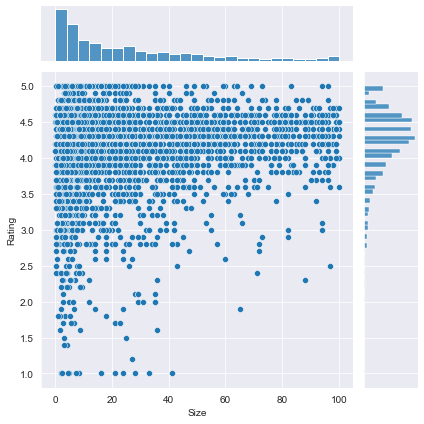
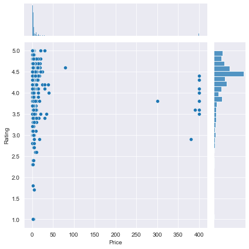
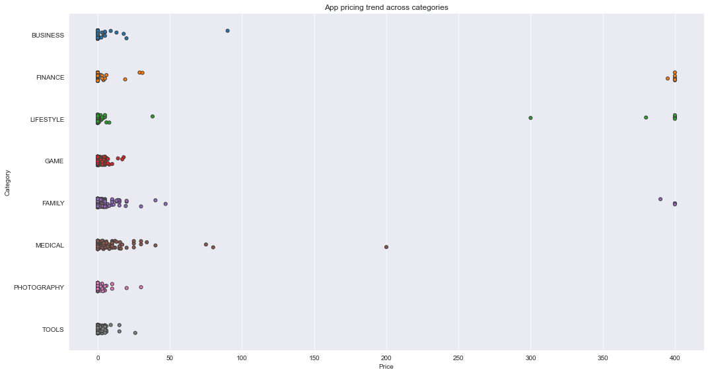
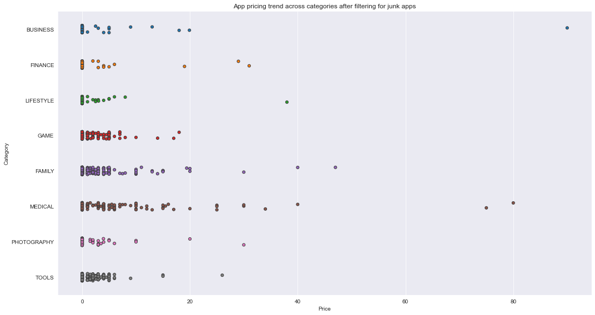
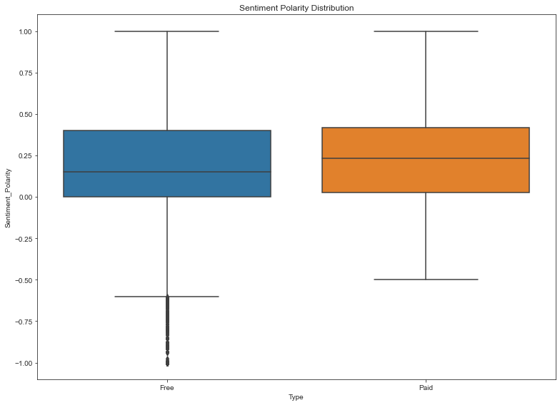

## 1. Google Play Store apps and reviews
<p>Mobile apps are everywhere. They are easy to create and can be lucrative. Because of these two factors, more and more apps are being developed. In this notebook, we will do a comprehensive analysis of the Android app market by comparing over ten thousand apps in Google Play across different categories. We'll look for insights in the data to devise strategies to drive growth and retention.</p>
<p></p>
<p>Let's take a look at the data, which consists of two files:</p>
<ul>
<li><code>apps.csv</code>: contains all the details of the applications on Google Play. There are 13 features that describe a given app.</li>
<li><code>user_reviews.csv</code>: contains 100 reviews for each app, <a href="https://www.androidpolice.com/2019/01/21/google-play-stores-redesigned-ratings-and-reviews-section-lets-you-easily-filter-by-star-rating/">most helpful first</a>. The text in each review has been pre-processed and attributed with three new features: Sentiment (Positive, Negative or Neutral), Sentiment Polarity and Sentiment Subjectivity.</li>
</ul>

```python
# Read in dataset
import pandas as pd
apps_with_duplicates = pd.read_csv('datasets/apps.csv')

# Drop duplicates
apps = apps_with_duplicates.drop_duplicates()

# Print the total number of apps
print('Total number of apps in the dataset = ', apps.size)

# Have a look at a random sample of 5 entries
n = 5
apps.sample(n)
```

    Total number of apps in the dataset =  135226

<table border="1" class="dataframe">
  <thead>
    <tr style="text-align: right;">
      <th></th>
      <th>Unnamed: 0</th>
      <th>App</th>
      <th>Category</th>
      <th>Rating</th>
      <th>Reviews</th>
      <th>Size</th>
      <th>Installs</th>
      <th>Type</th>
      <th>Price</th>
      <th>Content Rating</th>
      <th>Genres</th>
      <th>Last Updated</th>
      <th>Current Ver</th>
      <th>Android Ver</th>
    </tr>
  </thead>
  <tbody>
    <tr>
      <th>6705</th>
      <td>7764</td>
      <td>Deck Advisor for CR</td>
      <td>TOOLS</td>
      <td>4.1</td>
      <td>37975</td>
      <td>23.0</td>
      <td>5,000,000+</td>
      <td>Free</td>
      <td>0</td>
      <td>Everyone</td>
      <td>Tools</td>
      <td>February 2, 2017</td>
      <td>1.4.0</td>
      <td>4.1 and up</td>
    </tr>
    <tr>
      <th>9063</th>
      <td>10233</td>
      <td>funny Image Comments for FB</td>
      <td>SOCIAL</td>
      <td>3.9</td>
      <td>19</td>
      <td>15.0</td>
      <td>5,000+</td>
      <td>Free</td>
      <td>0</td>
      <td>Teen</td>
      <td>Social</td>
      <td>February 13, 2018</td>
      <td>2</td>
      <td>4.1 and up</td>
    </tr>
    <tr>
      <th>6526</th>
      <td>7581</td>
      <td>In to cm</td>
      <td>TOOLS</td>
      <td>NaN</td>
      <td>0</td>
      <td>2.3</td>
      <td>10+</td>
      <td>Free</td>
      <td>0</td>
      <td>Everyone</td>
      <td>Tools</td>
      <td>April 5, 2018</td>
      <td>1.1</td>
      <td>4.0.3 and up</td>
    </tr>
    <tr>
      <th>5595</th>
      <td>6620</td>
      <td>bp Magazine for Bipolar</td>
      <td>LIFESTYLE</td>
      <td>1.8</td>
      <td>5</td>
      <td>18.0</td>
      <td>1,000+</td>
      <td>Free</td>
      <td>0</td>
      <td>Everyone 10+</td>
      <td>Lifestyle</td>
      <td>February 12, 2018</td>
      <td>26</td>
      <td>4.1 and up</td>
    </tr>
    <tr>
      <th>9648</th>
      <td>10830</td>
      <td>News Minecraft.fr</td>
      <td>NEWS_AND_MAGAZINES</td>
      <td>3.8</td>
      <td>881</td>
      <td>2.3</td>
      <td>100,000+</td>
      <td>Free</td>
      <td>0</td>
      <td>Everyone</td>
      <td>News &amp; Magazines</td>
      <td>January 20, 2014</td>
      <td>1.5</td>
      <td>1.6 and up</td>
    </tr>
  </tbody>
</table>

```python
correct_apps_with_duplicates = pd.read_csv('datasets/apps.csv')

def test_pandas_loaded():
    assert ('pd' in globals()), "pandas is not imported and aliased as specified in the instructions."

def test_apps_with_duplicates_loaded():
#     correct_apps_with_duplicates = pd.read_csv('datasets/apps.csv')
    assert (correct_apps_with_duplicates.equals(apps_with_duplicates)), "The data was not correctly read into apps_with_duplicates."
    
def test_duplicates_dropped():
#     correct_apps_with_duplicates = pd.read_csv('datasets/apps.csv')
    correct_apps = correct_apps_with_duplicates.drop_duplicates()
    assert (correct_apps.equals(apps)), "The duplicates were not correctly dropped from apps_with_duplicates."
    
def test_total_apps():
    correct_total_apps = len(correct_apps_with_duplicates.drop_duplicates())
    assert (correct_total_apps == len(apps)), "The total number of apps is incorrect. It should equal 9659."
    
```

    4/4 tests passed

## 2. Data cleaning
<p>Data cleaning is one of the most essential subtask any data science project. Although it can be a very tedious process, it's worth should never be undermined.</p>
<p>By looking at a random sample of the dataset rows (from the above task), we observe that some entries in the columns like <code>Installs</code> and <code>Price</code> have a few special characters (<code>+</code> <code>,</code> <code>$</code>) due to the way the numbers have been represented. This prevents the columns from being purely numeric, making it difficult to use them in subsequent future mathematical calculations. Ideally, as their names suggest, we would want these columns to contain only digits from [0-9].</p>
<p>Hence, we now proceed to clean our data. Specifically, the special characters <code>,</code> and <code>+</code> present in <code>Installs</code> column and <code>$</code> present in <code>Price</code> column need to be removed.</p>
<p>It is also always a good practice to print a summary of your dataframe after completing data cleaning. We will use the <code>info()</code> method to acheive this.</p>

```python
# List of characters to remove
chars_to_remove = ['+', ',', '$']
# List of column names to clean
cols_to_clean = ['Installs', 'Price']

# Loop for each column in cols_to_clean
for col in cols_to_clean:
    # Loop for each char in chars_to_remove
    for char in chars_to_remove:
        # Replace the character with an empty string
        apps[col] = apps[col].apply(lambda x: x.replace(char, ''))  

# Print a summary of the apps dataframe
print(apps.info())
```

    <class 'pandas.core.frame.DataFrame'>
    Int64Index: 9659 entries, 0 to 9658
    Data columns (total 14 columns):
    Unnamed: 0        9659 non-null int64
    App               9659 non-null object
    Category          9659 non-null object
    Rating            8196 non-null float64
    Reviews           9659 non-null int64
    Size              8432 non-null float64
    Installs          9659 non-null object
    Type              9659 non-null object
    Price             9659 non-null object
    Content Rating    9659 non-null object
    Genres            9659 non-null object
    Last Updated      9659 non-null object
    Current Ver       9651 non-null object
    Android Ver       9657 non-null object
    dtypes: float64(2), int64(2), object(10)
    memory usage: 1.1+ MB
    None

```python
import numpy as np

def test_installs_plus():
    installs = apps['Installs'].values
    plus_removed_correctly = all('+' not in val for val in installs)
    assert plus_removed_correctly, \
    'Some of the "+" characters still remain in the Installs column.' 
    
def test_installs_comma():
    installs = apps['Installs'].values
    comma_removed_correctly = all(',' not in val for val in installs)
    assert comma_removed_correctly, \
    'Some of the "," characters still remain in the Installs column.'
    
def test_price_dollar():
    prices = apps['Price'].values
    dollar_removed_correctly = all('$' not in val for val in prices)
    assert dollar_removed_correctly, \
    'Some of the "$" characters still remain in the Price column.'

```

    3/3 tests passed

## 3. Correcting data types
<p>From the previous task we noticed that <code>Installs</code> and <code>Price</code> were categorized as <code>object</code> data type (and not <code>int</code> or <code>float</code>) as we would like. This is because these two columns originally had mixed input types: digits and special characters. To know more about Pandas data types, read <a href="https://datacarpentry.org/python-ecology-lesson/04-data-types-and-format/">this</a>.</p>
<p>The four features that we will be working with most frequently henceforth are <code>Installs</code>, <code>Size</code>, <code>Rating</code> and <code>Price</code>. While <code>Size</code> and <code>Rating</code> are both <code>float</code> (i.e. purely numerical data types), we still need to work on <code>Installs</code> and <code>Price</code> to make them numeric.</p>

```python
import numpy as np

# Convert Installs to float data type
apps['Installs'] = apps['Installs'].astype(float)

# Convert Price to float data type
apps['Price'] = apps['Price'].astype(float)

# Checking dtypes of the apps dataframe
print(apps.dtypes)
```

    Unnamed: 0          int64
    App                object
    Category           object
    Rating            float64
    Reviews             int64
    Size              float64
    Installs          float64
    Type               object
    Price             float64
    Content Rating     object
    Genres             object
    Last Updated       object
    Current Ver        object
    Android Ver        object
    dtype: object

```python
import numpy as np

def test_installs_numeric():
    assert isinstance(apps['Installs'][0], np.float64), \
    'The Installs column is not of numeric data type (float).'

def test_price_numeric():
    assert isinstance(apps['Price'][0], np.float64), \
    'The Price column is not of numeric data type (float).'
```

    2/2 tests passed

## 4. Exploring app categories
<p>With more than 1 billion active users in 190 countries around the world, Google Play continues to be an important distribution platform to build a global audience. For businesses to get their apps in front of users, it's important to make them more quickly and easily discoverable on Google Play. To improve the overall search experience, Google has introduced the concept of grouping apps into categories.</p>
<p>This brings us to the following questions:</p>
<ul>
<li>Which category has the highest share of (active) apps in the market? </li>
<li>Is any specific category dominating the market?</li>
<li>Which categories have the fewest number of apps?</li>
</ul>
<p>We will see that there are <code>33</code> unique app categories present in our dataset. <em>Family</em> and <em>Game</em> apps have the highest market prevalence. Interestingly, <em>Tools</em>, <em>Business</em> and <em>Medical</em> apps are also at the top.</p>

```python
import plotly
plotly.offline.init_notebook_mode(connected=True)
import plotly.graph_objs as go

# Print the total number of unique categories
num_categories = len(apps['Category'].unique())
print('Number of categories = ', num_categories)

# Count the number of apps in each 'Category'. 
num_apps_in_category = apps['Category'].value_counts()

# Sort num_apps_in_category in descending order based on the count of apps in each category
sorted_num_apps_in_category = num_apps_in_category.sort_values(ascending = False)

data = [go.Bar(
        x = num_apps_in_category.index, # index = category name
        y = num_apps_in_category.values, # value = count
)]

plotly.offline.iplot(data)
```

<script type="text/javascript">window.PlotlyConfig = {MathJaxConfig: 'local'};</script><script type="text/javascript">if (window.MathJax) {MathJax.Hub.Config({SVG: {font: "STIX-Web"}});}</script><script>requirejs.config({paths: { 'plotly': ['https://cdn.plot.ly/plotly-latest.min']},});if(!window._Plotly) {require(['plotly'],function(plotly) {window._Plotly=plotly;});}</script>

    Number of categories =  33

<div id="9d6c62c7-ecd6-4bd4-b7db-ab487328a10f" style="height: 525px; width: 100%;" class="plotly-graph-div"></div><script type="text/javascript">require(["plotly"], function(Plotly) { window.PLOTLYENV=window.PLOTLYENV || {};window.PLOTLYENV.BASE_URL="https://plot.ly";Plotly.newPlot("9d6c62c7-ecd6-4bd4-b7db-ab487328a10f", [{"x": ["FAMILY", "GAME", "TOOLS", "BUSINESS", "MEDICAL", "PERSONALIZATION", "PRODUCTIVITY", "LIFESTYLE", "FINANCE", "SPORTS", "COMMUNICATION", "HEALTH_AND_FITNESS", "PHOTOGRAPHY", "NEWS_AND_MAGAZINES", "SOCIAL", "BOOKS_AND_REFERENCE", "TRAVEL_AND_LOCAL", "SHOPPING", "DATING", "VIDEO_PLAYERS", "MAPS_AND_NAVIGATION", "EDUCATION", "FOOD_AND_DRINK", "ENTERTAINMENT", "AUTO_AND_VEHICLES", "LIBRARIES_AND_DEMO", "WEATHER", "HOUSE_AND_HOME", "ART_AND_DESIGN", "EVENTS", "PARENTING", "COMICS", "BEAUTY"], "y": [1832, 959, 827, 420, 395, 376, 374, 369, 345, 325, 315, 288, 281, 254, 239, 222, 219, 202, 171, 163, 131, 119, 112, 102, 85, 84, 79, 74, 64, 64, 60, 56, 53], "type": "bar", "uid": "962c4ef8-8c14-4553-a161-2ea28cc4491d"}], {}, {"showLink": true, "linkText": "Export to plot.ly", "plotlyServerURL": "https://plot.ly"})});</script><script type="text/javascript">window.addEventListener("resize", function(){window._Plotly.Plots.resize(document.getElementById("9d6c62c7-ecd6-4bd4-b7db-ab487328a10f"));});</script>

```python
def test_num_categories():
    assert num_categories == 33, "The number of app categories is incorrect. It should equal 33."
    
def test_num_apps_in_category():
    correct_sorted_num_apps_in_category = apps['Category'].value_counts().sort_values(ascending=False)
    assert (correct_sorted_num_apps_in_category == sorted_num_apps_in_category).all(), "sorted_num_apps_in_category is not what we expected. Please inspect the hint."
```

    2/2 tests passed

## 5. Distribution of app ratings
<p>After having witnessed the market share for each category of apps, let's see how all these apps perform on an average. App ratings (on a scale of 1 to 5) impact the discoverability, conversion of apps as well as the company's overall brand image. Ratings are a key performance indicator of an app.</p>
<p>From our research, we found that the average volume of ratings across all app categories is <code>4.17</code>. The histogram plot is skewed to the left indicating that the majority of the apps are highly rated with only a few exceptions in the low-rated apps.</p>

```python
# Average rating of apps
avg_app_rating = apps['Rating'].mean()
print('Average app rating = ', avg_app_rating)

# Distribution of apps according to their ratings
data = [go.Histogram(
        x = apps['Rating'],
        xbins = {'start': 1, 'size': 0.1, 'end' : 5}
)]

# Vertical dashed line to indicate the average app rating
layout = {'shapes': [{
              'type' :'line',
              'x0': avg_app_rating,
              'y0': 0,
              'x1': avg_app_rating,
              'y1': 1000,
              'line': { 'dash': 'dashdot'}
          }]
          }

plotly.offline.iplot({'data': data, 'layout': layout})
```

    Average app rating =  4.173243045387994

```python
def test_app_avg_rating():
    assert round(avg_app_rating, 5) == 4.17324, \
    "The average app rating rounded to five digits should be 4.17324."
    
# def test_x_histogram():
#     correct_x_histogram = apps['Rating']
#     assert correct_x_histogram.all() == data[0]['x'].all(), \
#     'x should equal Rating column'
```

    1/1 tests passed

## 6. Size and price of an app
<p>Let's now examine app size and app price. For size, if the mobile app is too large, it may be difficult and/or expensive for users to download. Lengthy download times could turn users off before they even experience your mobile app. Plus, each user's device has a finite amount of disk space. For price, some users expect their apps to be free or inexpensive. These problems compound if the developing world is part of your target market; especially due to internet speeds, earning power and exchange rates.</p>
<p>How can we effectively come up with strategies to size and price our app?</p>
<ul>
<li>Does the size of an app affect its rating? </li>
<li>Do users really care about system-heavy apps or do they prefer light-weighted apps? </li>
<li>Does the price of an app affect its rating? </li>
<li>Do users always prefer free apps over paid apps?</li>
</ul>
<p>We find that the majority of top rated apps (rating over 4) range from 2 MB to 20 MB. We also find that the vast majority of apps price themselves under \$10.</p>

```python
%matplotlib inline
import seaborn as sns
sns.set_style("darkgrid")
import warnings
warnings.filterwarnings("ignore")

# Select rows where both 'Rating' and 'Size' values are present (ie. the two values are not null)
apps_with_size_and_rating_present = apps[(~apps['Rating'].isnull()) & (~apps['Size'].isnull())]

# Subset for categories with at least 250 apps
large_categories = apps_with_size_and_rating_present.groupby(['Category']).filter(lambda x: len(x) >= 250)

# Plot size vs. rating
plt1 = sns.jointplot(x = large_categories['Size'], y = large_categories['Rating'])

# Select apps whose 'Type' is 'Paid'
paid_apps = apps_with_size_and_rating_present[apps_with_size_and_rating_present['Type'] == 'Paid']

# Plot price vs. rating
plt2 = sns.jointplot(x = paid_apps['Price'], y = paid_apps['Rating'])
```





```python
correct_apps_with_size_and_rating_present = apps[(~apps['Rating'].isnull()) & (~apps['Size'].isnull())]
 
def test_apps_with_size_and_rating_present():
    global correct_apps_with_size_and_rating_present
    assert correct_apps_with_size_and_rating_present.equals(apps_with_size_and_rating_present)
    "The correct_apps_with_size_and_rating_present is not what we expected. Please review the instructions and check the hint if necessary."
    
def test_large_categories():
    global correct_apps_with_size_and_rating_present
    correct_large_categories = correct_apps_with_size_and_rating_present.groupby(['Category']).filter(lambda x: len(x) >= 250)
    assert correct_large_categories.equals(large_categories), \
    "The large_categories DataFrame is not what we expected. Please review the instructions and check the hint if necessary."

def test_size_vs_rating():
    global correct_apps_with_size_and_rating_present
    correct_large_categories = correct_apps_with_size_and_rating_present.groupby('Category').filter(lambda x: len(x) >= 250)
#     correct_large_categories = correct_large_categories[correct_large_categories['Size'].notnull()]
#     correct_large_categories = correct_large_categories[correct_large_categories['Rating'].notnull()]
    assert plt1.x.tolist() == large_categories['Size'].values.tolist() and plt1.y.tolist() == large_categories['Rating'].values.tolist(), \
    "The size vs. rating jointplot is not what we expected. Please review the instructions and check the hint if necessary."
    
def test_paid_apps():
    global correct_apps_with_size_and_rating_present
    correct_paid_apps = correct_apps_with_size_and_rating_present[correct_apps_with_size_and_rating_present['Type'] == 'Paid']
    assert correct_paid_apps.equals(paid_apps), \
    "The paid_apps DataFrame is not what we expected. Please review the instructions and check the hint if necessary."
    
def test_price_vs_rating():
    global correct_apps_with_size_and_rating_present
    correct_paid_apps = correct_apps_with_size_and_rating_present[correct_apps_with_size_and_rating_present['Type'] == 'Paid']
#     correct_paid_apps = correct_paid_apps[correct_paid_apps['Price'].notnull()]
#     correct_paid_apps = correct_paid_apps[correct_paid_apps['Rating'].notnull()]
    assert plt2.x.tolist() == correct_paid_apps['Price'].values.tolist() and plt2.y.tolist() == correct_paid_apps['Rating'].values.tolist(), \
    "The price vs. rating jointplot is not what we expected. Please review the instructions and check the hint if necessary."
```

    5/5 tests passed

## 7. Relation between app category and app price
<p>So now comes the hard part. How are companies and developers supposed to make ends meet? What monetization strategies can companies use to maximize profit? The costs of apps are largely based on features, complexity, and platform.</p>
<p>There are many factors to consider when selecting the right pricing strategy for your mobile app. It is important to consider the willingness of your customer to pay for your app. A wrong price could break the deal before the download even happens. Potential customers could be turned off by what they perceive to be a shocking cost, or they might delete an app they’ve downloaded after receiving too many ads or simply not getting their money's worth.</p>
<p>Different categories demand different price ranges. Some apps that are simple and used daily, like the calculator app, should probably be kept free. However, it would make sense to charge for a highly-specialized medical app that diagnoses diabetic patients. Below, we see that <em>Medical and Family</em> apps are the most expensive. Some medical apps extend even up to \$80! All game apps are reasonably priced below \$20.</p>

```python
import matplotlib.pyplot as plt
fig, ax = plt.subplots()
fig.set_size_inches(15, 8)

# Select a few popular app categories
popular_app_cats = apps[apps.Category.isin(['GAME', 'FAMILY', 'PHOTOGRAPHY',
                                            'MEDICAL', 'TOOLS', 'FINANCE',
                                            'LIFESTYLE','BUSINESS'])]

# Examine the price trend for the subset of categories
ax = sns.stripplot(x='Price', y='Category', data=popular_app_cats,
                   jitter=True, linewidth=1)
ax.set_title('App pricing trend across categories')

# Category, Name and Price of apps priced above $200
apps_above_200 = apps[apps['Price'] > 200][['Category', 'App', 'Price']]
apps_above_200
```

<table border="1" class="dataframe">
  <thead>
    <tr style="text-align: right;">
      <th></th>
      <th>Category</th>
      <th>App</th>
      <th>Price</th>
    </tr>
  </thead>
  <tbody>
    <tr>
      <th>3327</th>
      <td>FAMILY</td>
      <td>most expensive app (H)</td>
      <td>399.99</td>
    </tr>
    <tr>
      <th>3465</th>
      <td>LIFESTYLE</td>
      <td>💎 I'm rich</td>
      <td>399.99</td>
    </tr>
    <tr>
      <th>3469</th>
      <td>LIFESTYLE</td>
      <td>I'm Rich - Trump Edition</td>
      <td>400.00</td>
    </tr>
    <tr>
      <th>4396</th>
      <td>LIFESTYLE</td>
      <td>I am rich</td>
      <td>399.99</td>
    </tr>
    <tr>
      <th>4398</th>
      <td>FAMILY</td>
      <td>I am Rich Plus</td>
      <td>399.99</td>
    </tr>
    <tr>
      <th>4399</th>
      <td>LIFESTYLE</td>
      <td>I am rich VIP</td>
      <td>299.99</td>
    </tr>
    <tr>
      <th>4400</th>
      <td>FINANCE</td>
      <td>I Am Rich Premium</td>
      <td>399.99</td>
    </tr>
    <tr>
      <th>4401</th>
      <td>LIFESTYLE</td>
      <td>I am extremely Rich</td>
      <td>379.99</td>
    </tr>
    <tr>
      <th>4402</th>
      <td>FINANCE</td>
      <td>I am Rich!</td>
      <td>399.99</td>
    </tr>
    <tr>
      <th>4403</th>
      <td>FINANCE</td>
      <td>I am rich(premium)</td>
      <td>399.99</td>
    </tr>
    <tr>
      <th>4406</th>
      <td>FAMILY</td>
      <td>I Am Rich Pro</td>
      <td>399.99</td>
    </tr>
    <tr>
      <th>4408</th>
      <td>FINANCE</td>
      <td>I am rich (Most expensive app)</td>
      <td>399.99</td>
    </tr>
    <tr>
      <th>4410</th>
      <td>FAMILY</td>
      <td>I Am Rich</td>
      <td>389.99</td>
    </tr>
    <tr>
      <th>4413</th>
      <td>FINANCE</td>
      <td>I am Rich</td>
      <td>399.99</td>
    </tr>
    <tr>
      <th>4417</th>
      <td>FINANCE</td>
      <td>I AM RICH PRO PLUS</td>
      <td>399.99</td>
    </tr>
    <tr>
      <th>8763</th>
      <td>FINANCE</td>
      <td>Eu Sou Rico</td>
      <td>394.99</td>
    </tr>
    <tr>
      <th>8780</th>
      <td>LIFESTYLE</td>
      <td>I'm Rich/Eu sou Rico/أنا غني/我很有錢</td>
      <td>399.99</td>
    </tr>
  </tbody>
</table>



```python
last_output = _

def test_apps_above_200():
    assert len(apps_above_200) == 17, "There should be 17 apps priced above 200 in apps_above_200."
```

    1/1 tests passed

## 8. Filter out "junk" apps
<p>It looks like a bunch of the really expensive apps are "junk" apps. That is, apps that don't really have a purpose. Some app developer may create an app called <em>I Am Rich Premium</em> or <em>most expensive app (H)</em> just for a joke or to test their app development skills. Some developers even do this with malicious intent and try to make money by hoping people accidentally click purchase on their app in the store.</p>
<p>Let's filter out these junk apps and re-do our visualization.</p>

```python
# Select apps priced below $100
apps_under_100 = popular_app_cats[popular_app_cats['Price'] < 100]

fig, ax = plt.subplots()
fig.set_size_inches(15, 8)

# Examine price vs category with the authentic apps
ax = sns.stripplot(x='Price', y='Category', data=apps_under_100,
                   jitter=True, linewidth=1)
ax.set_title('App pricing trend across categories after filtering for junk apps')
```

    Text(0.5, 1.0, 'App pricing trend across categories after filtering for junk apps')



```python
def test_apps_under_100():
    correct_apps_under_100 = popular_app_cats[popular_app_cats['Price'] < 100]
    assert correct_apps_under_100.equals(apps_under_100), \
    "The apps_under_100 DataFrame is not what we expected. Please review the instructions and check the hint if necessary."
```

    1/1 tests passed

## 9. Popularity of paid apps vs free apps
<p>For apps in the Play Store today, there are five types of pricing strategies: free, freemium, paid, paymium, and subscription. Let's focus on free and paid apps only. Some characteristics of free apps are:</p>
<ul>
<li>Free to download.</li>
<li>Main source of income often comes from advertisements.</li>
<li>Often created by companies that have other products and the app serves as an extension of those products.</li>
<li>Can serve as a tool for customer retention, communication, and customer service.</li>
</ul>
<p>Some characteristics of paid apps are:</p>
<ul>
<li>Users are asked to pay once for the app to download and use it.</li>
<li>The user can't really get a feel for the app before buying it.</li>
</ul>
<p>Are paid apps installed as much as free apps? It turns out that paid apps have a relatively lower number of installs than free apps, though the difference is not as stark as I would have expected!</p>

```python
trace0 = go.Box(
    # Data for paid apps
    y=apps[apps['Type'] == 'Paid']['Installs'],
    name = 'Paid'
)

trace1 = go.Box(
    # Data for free apps
    y=apps[apps['Type'] == 'Free']['Installs'],
    name = 'Free'
)

layout = go.Layout(
    title = "Number of downloads of paid apps vs. free apps",
    yaxis = dict(
        type = 'log',
        autorange = True
    )
)

# Add trace0 and trace1 to a list for plotting
data = [trace0, trace1]
plotly.offline.iplot({'data': data, 'layout': layout})
```

```python
def test_trace0_y():
    correct_y = apps['Installs'][apps['Type'] == 'Paid']
    assert all(trace0['y'] == correct_y.values), \
    "The y data for trace0 appears incorrect. Please review the instructions and check the hint if necessary."

def test_trace1_y():
    correct_y_1 = apps['Installs'][apps['Type'] == 'Free']
    correct_y_2 = apps['Installs'][apps['Price'] == 0]
    try:
        check_1 = all(trace1['y'] == correct_y_1.values)
    except:
        check_1 = False
    try:
        check_2 = all(trace1['y'] == correct_y_2.values)
    except:
        check_2 = False
        
    assert check_1 or check_2, \
    "The y data for trace1 appears incorrect. Please review the instructions and check the hint if necessary."
```

    2/2 tests passed

## 10. Sentiment analysis of user reviews
<p>Mining user review data to determine how people feel about your product, brand, or service can be done using a technique called sentiment analysis. User reviews for apps can be analyzed to identify if the mood is positive, negative or neutral about that app. For example, positive words in an app review might include words such as 'amazing', 'friendly', 'good', 'great', and 'love'. Negative words might be words like 'malware', 'hate', 'problem', 'refund', and 'incompetent'.</p>
<p>By plotting sentiment polarity scores of user reviews for paid and free apps, we observe that free apps receive a lot of harsh comments, as indicated by the outliers on the negative y-axis. Reviews for paid apps appear never to be extremely negative. This may indicate something about app quality, i.e., paid apps being of higher quality than free apps on average. The median polarity score for paid apps is a little higher than free apps, thereby syncing with our previous observation.</p>
<p>In this notebook, we analyzed over ten thousand apps from the Google Play Store. We can use our findings to inform our decisions should we ever wish to create an app ourselves.</p>

```python
# Load user_reviews.csv
reviews_df = pd.read_csv('datasets/user_reviews.csv')

# Join the two dataframes
merged_df = pd.merge(apps, reviews_df, on = "App")

# Drop NA values from Sentiment and Review columns
merged_df = merged_df.dropna(subset = ['Sentiment', 'Review'])

sns.set_style('ticks')
fig, ax = plt.subplots()
fig.set_size_inches(11, 8)

# User review sentiment polarity for paid vs. free apps
ax = sns.boxplot(x = 'Type', y = 'Sentiment_Polarity', data = merged_df)
ax.set_title('Sentiment Polarity Distribution')
```

    Text(0.5, 1.0, 'Sentiment Polarity Distribution')



```python
def test_user_reviews_loaded():
    correct_user_reviews = pd.read_csv('datasets/user_reviews.csv')
    assert (correct_user_reviews.equals(reviews_df)), "The user_reviews.csv file was not correctly loaded. Please review the instructions and inspect the hint if necessary."
    
def test_user_reviews_merged():
    user_reviews = pd.read_csv('datasets/user_reviews.csv')
    correct_merged = pd.merge(apps, user_reviews, on = "App")
    correct_merged = correct_merged.dropna(subset=['Sentiment', 'Review'])
    assert (correct_merged.equals(merged_df)), "The merging of user_reviews and apps is incorrect. Please review the instructions and inspect the hint if necessary."
    
def test_project_reset():
    user_reviews = pd.read_csv('datasets/user_reviews.csv')
    assert ('Translated_Reviews' not in user_reviews.columns), "There is an update in the project and some column names have been changed. Please choose the \"Reset Project\" option to fetch the updated copy of the project."
    
```

    3/3 tests passed
